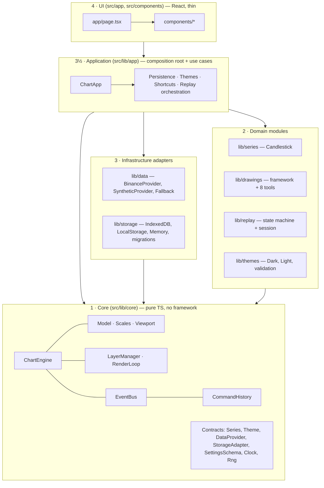
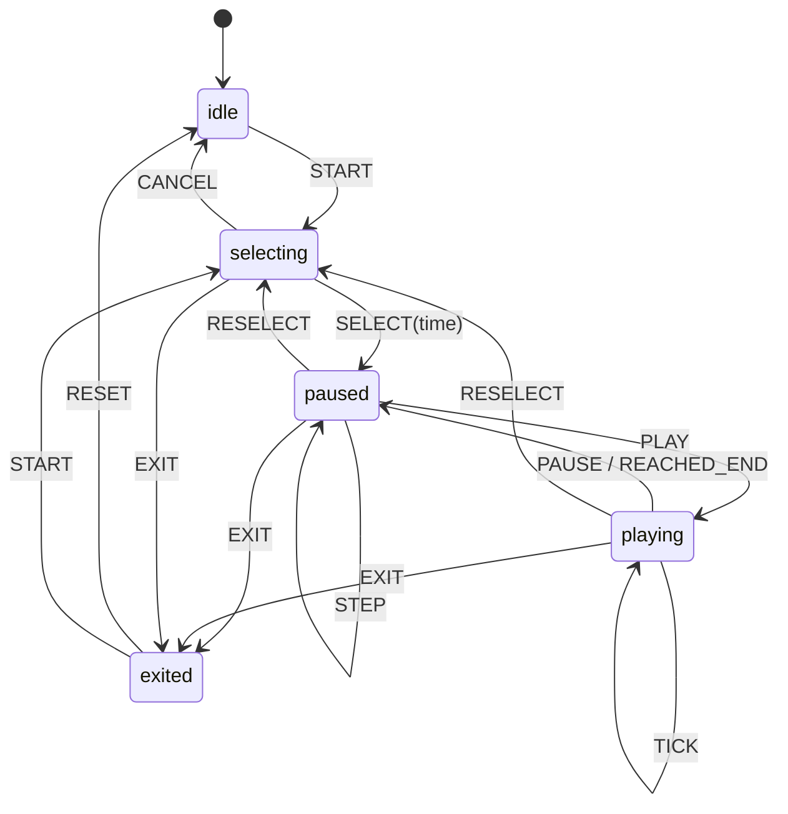

# Architecture

TradingChart is a candlestick charting app with a custom HTML5 Canvas 2D engine. This document
is the contract every change must respect. It covers the layers, the dependency rules (and how
they are enforced), state ownership, data flow, the rendering pipeline and the extension points.

## 1. Layers



| Element                             | Path             | May import                       |
| ----------------------------------- | ---------------- | -------------------------------- |
| core                                | `src/lib/core`   | core                             |
| series / drawings / replay / themes | `src/lib/<m>`    | core, itself                     |
| data / storage                      | `src/lib/<m>`    | core, itself                     |
| app (composition root)              | `src/lib/app`    | every `src/lib` module           |
| components                          | `src/components` | lib **barrels only**, components |
| next                                | `src/app`        | lib barrels, components          |

Domain modules never import each other. They talk through contracts defined in core
(`src/lib/core/contracts`) and are wired together by the application layer.

### Enforcement

- `eslint-rules/layer-boundaries.mjs` — a zero-dependency local ESLint rule. It resolves every
  import (alias or relative) to an element, checks the matrix above, rejects `react`, `react-dom`,
  `next` and `zustand` inside `src/lib`, and forces UI code through the barrel (`@/lib/drawings`,
  never `@/lib/drawings/tools/trend-line`).
- `no-restricted-properties` / `no-restricted-syntax` forbid `Date.now()`, `new Date()`,
  `Math.random()` and `performance.now()` in core, series, drawings and replay. Time and
  randomness are injected via `Clock` and `Rng`.

## 2. Module map

```
src/lib/core/
  contracts/      Interfaces shared across layers (Series, Theme, DataProvider, StorageAdapter,
                  SettingsSchema, Clock, Rng, FrameScheduler, Timer)
  util/           Pure helpers: math, geometry, color, format, binary search, rng, ids
  time/           Timeframe definitions, bucket math, aggregation
  data/           SeriesData (Float64Array OHLCV columns) + RangeMinMax index
  scales/         TimeScale (bar index <-> x), PriceScale (linear/log/percent), tick generators
  model/          ChartOptions, layout (panes/axes), coordinates facade used by plugins
  render/         Surface, Layer, LayerManager, RenderLoop, built-in renderers (grid, axes, crosshair…)
  interaction/    Pointer router, pan/zoom/axis gestures, touch (pinch, long-press), handler stack
  events/         Typed EventBus + ChartEventMap
  commands/       Command interface + CommandHistory (undo/redo)
  registry/       Generic Registry<T>
  engine/         ChartEngine facade (composes everything above)
src/lib/series/     SeriesRegistry + candlestick module
src/lib/drawings/   framework/ (Drawing, BaseDrawing, DrawingManager, placement, hit-test, commands,
                    schema helpers, render helpers) + tools/<one folder per tool> + register.ts
src/lib/replay/     replay-machine.ts (pure FSM), ReplaySession (data windowing), ReplayController
src/lib/themes/     ThemeRegistry, built-ins, theme validation (zod)
src/lib/data/       BinanceProvider, SyntheticProvider, FallbackProvider, symbol catalogue, registry
src/lib/storage/    IndexedDBStorage, LocalStorageStorage, MemoryStorage, envelopes, migrations/
src/lib/app/        ChartApp (composition root), persistence, theme service, shortcut registry,
                    UI-state bridge (engine events -> zustand store for panels)
src/components/     React: shell, toolbars, dialogs, schema-form, replay bar, overlays
src/app/            layout.tsx, page.tsx, api/klines/route.ts
```

## 3. State ownership

| State                                    | Owner                    | Mutated by                         |
| ---------------------------------------- | ------------------------ | ---------------------------------- |
| Candles (typed arrays), viewport, scales | `ChartEngine` / model    | engine API, gestures               |
| Drawings, selection, hover, active tool  | `DrawingManager`         | Commands (mutations), interaction  |
| Undo/redo stack                          | `CommandHistory` (core)  | `execute`/`undo`/`redo`            |
| Chart options (behaviour flags)          | engine model             | `UpdateChartOptionsCommand`        |
| Themes (built-in + custom), active theme | `ThemeService` (app)     | service methods -> engine.setTheme |
| Replay state                             | `ReplayController` + FSM | FSM events only                    |
| Full (unrevealed) history during replay  | `ReplaySession`          | never exposed to the engine        |
| Dialog open/close, menus, UI mirrors     | zustand `useUiStore`     | React + event bridge               |

React **never** holds candles, viewport or drawings. Components receive UI-level snapshots
(selected drawing id + style, history flags, replay state) from the zustand store, which is fed
by a single event bridge subscribed to the engine's event bus. High-frequency data (crosshair
legend) is written straight to DOM nodes via refs, so no component re-renders at 60 fps.

## 4. Data flow

```mermaid
sequenceDiagram
  participant UI as React UI
  participant App as ChartApp
  participant P as DataProvider
  participant E as ChartEngine
  participant D as DrawingManager
  UI->>App: setSymbol / setTimeframe
  App->>P: fetchBars({symbol, timeframe, limit})
  P-->>App: Candle[] (ascending)
  App->>E: setData(SeriesData)
  E-->>UI: bus 'data:changed' / 'viewport:changed'
  E->>E: user pans to left edge -> bus 'viewport:needs-history'
  App->>P: fetchBars({endTime: firstTime-1})
  App->>E: prependData(older)
  UI->>D: pick tool; pointer events flow E(interaction) -> D(handler)
  D->>App: CommandHistory.execute(AddDrawingCommand)
  App->>App: persistence autosave (debounced, per symbol)
```

`/api/klines` (Route Handler) proxies Binance REST (`data-api.binance.vision`, then
`api.binance.com`) with an in-memory TTL cache. On upstream failure it answers with synthetic
bars (header `x-data-source: synthetic`). The client `FallbackProvider` additionally falls back to
the in-browser `SyntheticProvider` if the route itself is unreachable.

## 5. Rendering pipeline

1. Anything that changes calls `engine.invalidate(mask)` with a bitmask of layers.
2. `RenderLoop` coalesces invalidations into a single `requestAnimationFrame` (injected
   `FrameScheduler`).
3. On the frame, the engine recomputes layout and auto-scale once, then each **dirty** layer is
   cleared and redrawn, bottom to top:

| Layer        | Content                                                      | Typical invalidation     |
| ------------ | ------------------------------------------------------------ | ------------------------ |
| `background` | background (solid/gradient), grid, watermark                 | viewport, theme, options |
| `series`     | volume pane, candles, last-price / prev-close lines          | data, viewport, theme    |
| `drawings`   | registered plugin layer from `DrawingManager`                | drawings, viewport       |
| `axes`       | price axis, volume axis, time axis, last-price label         | viewport, data           |
| `overlay`    | crosshair + axis labels, placement previews, replay cut line | pointer move             |

Pointer moves only dirty `overlay` (plus `drawings` when hover state changes), so crosshair
movement over 50k candles costs almost nothing.

Performance techniques:

- OHLCV lives in `Float64Array` columns (`SeriesData`) with amortised growth for appends and
  prepends.
- **Viewport culling** — only bar indices in `[floor(left), ceil(right)]` are touched; drawings
  whose bounding box misses the plot are skipped.
- **Level of detail** — below ~2 px per bar the candle renderer switches to per-pixel-column
  decimation (min low / max high per column, one stroke per colour).
- **Batched paths** — one `Path2D`-free `beginPath()` per colour and primitive type.
- **Auto-scale in O(n/64)** — `RangeMinMax` keeps block min/max so visible-range queries don't
  scan every bar; it updates incrementally on replay appends.
- **Time-axis weights** are computed once per data change (`Uint8Array`), tick selection per frame
  only touches visible bars grouped by weight.
- Device pixel ratio handled per surface; canvases are resized only on `ResizeObserver` events.

## 6. Coordinates

- Bars are addressed by **integer index**; `TimeScale` maps index ↔ x with `barSpacing` and
  `rightIndex` (the fractional index at the plot's right edge, which may exceed the last bar —
  that is TradingView's future space / right margin).
- Time ↔ index is piecewise linear between bars and extrapolated by the timeframe interval
  outside the data, giving a **fractional index**. Drawings store `(time, price)` and survive
  timeframe changes, prepends, replay and scale-type changes.
- `PriceScale` maps price → logical value (`linear: p`, `log: ln p`, `percent: (p/base − 1)·100`)
  → y, with inversion and top/bottom margins. All three are unit-tested for round-trips.

## 7. Interaction

`PointerRouter` (core) classifies each pointer event by region (plot, price axis, volume axis,
time axis) and offers plot events to a **priority stack of `InteractionHandler`s** registered by
plugins (replay start-point picker, drawing placement, drawing editing). If no handler captures
the gesture, the built-in navigation runs: pan, wheel/pinch zoom anchored at the cursor, axis
drag scaling, double-click axis reset, long-press crosshair on touch. Keyboard input is handled
by the application's `ShortcutRegistry`, which dispatches to engine/app actions.

## 8. Extension points

All are `Registry<T>` instances; every entry self-describes (id, label, icon, defaults, schema,
factory). Adding a module = one new file/folder + one line in the module's `register.ts`.

| Extension         | Contract                 | Register in                                                                                            |
| ----------------- | ------------------------ | ------------------------------------------------------------------------------------------------------ |
| Drawing tool      | `DrawingToolDefinition`  | `src/lib/drawings/register.ts`                                                                         |
| Chart/series type | `SeriesDefinition`       | `src/lib/series/register.ts`                                                                           |
| Theme             | `Theme`                  | `src/lib/themes/register.ts`                                                                           |
| Data provider     | `DataProviderDefinition` | `src/lib/data/register.ts`                                                                             |
| Storage adapter   | `StorageAdapter`         | chosen in `src/lib/app/composition.ts`                                                                 |
| Storage migration | `Migration`              | `src/lib/storage/migrations/index.ts`                                                                  |
| Shortcut          | `ShortcutDefinition`     | `src/lib/app/shortcuts/default-shortcuts.ts` (tool shortcuts come from tool definitions automatically) |

The UI iterates registries: the drawing toolbar, the settings dialog, the floating toolbar and
the shortcuts dialog contain no per-tool code.

## 9. Commands, events, persistence

- **Commands** (`execute`/`undo`, optional `merge`) wrap every mutation: add/remove/update
  drawing (snapshot based), reorder, bulk lock/hide/remove, chart-option changes. Continuous
  gestures (drag an anchor) mutate a live preview and commit exactly one command on release.
- **EventBus** is typed by `ChartEventMap`; `on()` returns an unsubscribe function.
- **Persistence**: every stored value is an `Envelope { kind, schemaVersion, data }`. Loading
  runs `migrate(kind, envelope)` through the ordered steps in `storage/migrations`, then zod
  validation, then the registry factory. Unknown drawing types are skipped (never crash).

## 10. Determinism

`Clock` and `Rng` are injected. Replay advances by explicit ticks from an injected `Timer`, the
synthetic provider is a pure function of `(symbol, timeframe, time, seed)`, and tests use
`ManualClock` / fixed seeds. Replay never leaks future data: the engine only ever receives the
revealed `SeriesData`, so auto-scale, legend, crosshair and position-tool evaluation cannot see
hidden candles.

## 11. Replay



`ReplaySession` keeps the replay cursor as a **time** (`cursorTime`, exclusive) plus a step
resolution (`baseTimeframe`). Switching to a higher timeframe keeps the finer resolution, so the
current higher-timeframe candle forms bar-by-bar from finer data; switching lower moves the
resolution down. Completed bars before the replay start come from chart-timeframe data; bars
formed during replay are aggregated from base data so nothing jumps when a bucket closes.

## 12. Next.js specifics

- `app/page.tsx` renders a client wrapper that loads the chart shell with
  `next/dynamic(..., { ssr: false })`.
- The engine is created inside `useEffect` and destroyed in the cleanup (cancels rAF, timers,
  listeners, `ResizeObserver`), so Strict Mode double mounting is harmless.
- Persisted themes/drawings are loaded in effects; no `Date.now()`/`Math.random()` during render.
